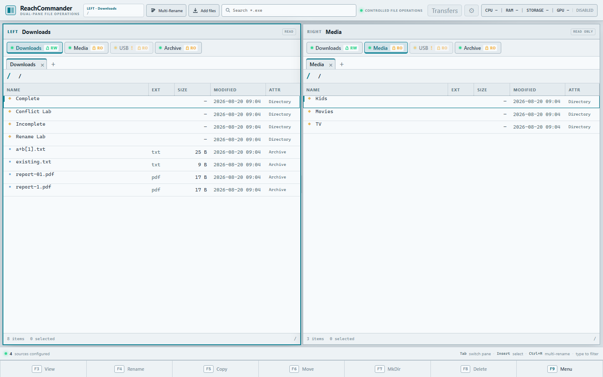
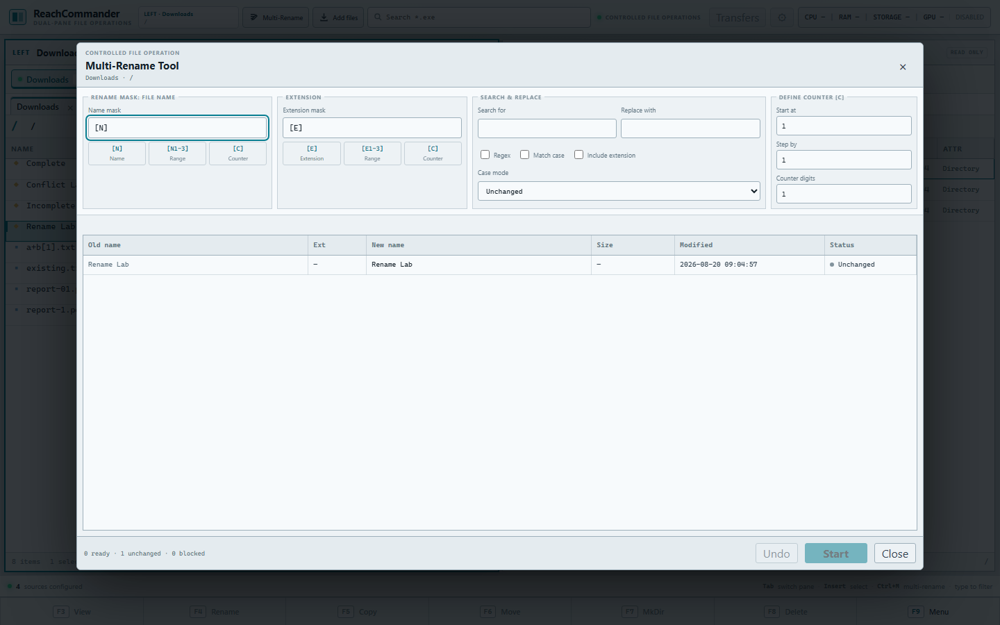

# ReachCommander

[](https://github.com/dragosniamtu/reach-commander/actions/workflows/ci.yml)
[](LICENSE)
[](https://dotnet.microsoft.com/)
[](https://angular.dev/)
[](Dockerfile)

ReachCommander is a production-oriented, self-hosted dual-pane file manager inspired by Total Commander. It pairs an installable Angular 22 Progressive Web App with an ASP.NET Core 10 backend to deliver read-only ZIP/RAR/7z browsing, controlled archive extraction, authoritative batch rename, bounded streamed uploads, wildcard search, cross-platform hardware telemetry, and hardened filesystem confinement on native Windows and containerized Linux hosts.



> **Security boundary:** ReachCommander includes built-in single-administrator authentication with an HttpOnly cookie session, but it does not terminate TLS. Keep the application port on loopback and publish it through an HTTPS reverse proxy. Optional proxy authentication can add defense in depth; it is no longer the application's only login boundary. Checked-in sources and Docker mounts remain read-only until an administrator explicitly opts one narrow source into writes.

## Why this project

ReachCommander demonstrates more than a file-browser UI:

- **Server-authoritative mutations:** previews are short-lived plans; execution revalidates paths, fingerprints, conflicts, source policy, and write access before Copy, Move, Delete, Restore, MkDir, rename, upload, or extraction.
- **Durable transfer safety:** one persisted FIFO queue stages copies beside their destination, commits before cross-device source removal, survives restarts, supports cancellation, and reports logical recovery data without leaking host paths.
- **Safe batch algorithms:** two-phase temporary renames support swaps, cycles, and case-only changes with compensation and one-level Undo.
- **Streamed upload safety:** multipart files are bounded, staged beside their destination, committed all-or-nothing, and serialized with renames through a shared directory lock.
- **Isolated archive handling:** ZIP, RAR, and 7z parsing runs in a bounded child worker; previews are immutable, extraction is conflict-safe, and the worker never receives destination paths.
- **Cross-platform observability:** Windows and Linux collectors normalize CPU, memory, storage, GPU, temperature, fan, network, and uptime data without shelling out to vendor tools.
- **Installable without data leakage:** Angular's production service worker caches only the versioned application shell; filesystem listings and every `/api` response remain network-only.
- **Built-in authentication:** first-run administrator creation, rate-limited login, antiforgery protection, password change, logout, and persisted cookie keys protect the API and Angular shell.
- **Testable accessibility:** keyboard-first pane control, focus trapping/restoration, live regions, explicit RO/RW semantics, and deterministic browser acceptance at desktop and compact widths.

| Layer | Technology |
|---|---|
| Frontend | Angular 22 standalone components, Signals, RxJS, Angular CDK A11y, installable PWA shell |
| Backend | ASP.NET Core 10, layered application/domain/infrastructure projects |
| Storage boundary | Configured local roots, canonical path confinement, symlink rejection |
| Deployment | Single-origin PWA publish, native Windows development plus Docker deployment on Ubuntu and macOS |
| Quality | 600+ cross-platform .NET checks, 295 Angular tests, PWA contract tests, and 27 real-browser scenarios |

## What ReachCommander includes

- Source buttons above both panes, loaded only from external JSON configuration.
- Independent source, tab, path, cursor, selection, sort, and filter state per pane.
- Browser persistence for pane identity, tabs, logical paths, sorting, and filters.
- Dense details tables with directories first, sortable columns, capacity, read-only, and unavailable-source states.
- Centralized Total Commander-style keyboard handling and a permanent function-key bar.
- A contextual top toolbar for Multi-Rename, Add files, and active-panel search.
- A persistent Norton Commander-inspired theme, activated from the top toolbar and stored only in the current browser or installed PWA.
- Explicit `RO`, `RW`, and unavailable source states.
- Read-only source discovery, directory listing, and file-information APIs.
- Server-authoritative Multi-Rename previews, all-or-nothing execution, compensation, and one-level Undo.
- Bounded streamed multi-file uploads with review, progress, cancellation, conflict rejection, and compensation.
- Read-only virtual browsing for supported single and multi-volume ZIP, RAR, and 7z archives.
- F5 extraction of selected archive entries or one focused unopened archive, with immutable review, live progress, cancellation, conflict blocking, and recovery guidance.
- F5 Copy, F6 Move, F7 MkDir, and F8 Delete with immutable previews, durable queued progress, Background/restore, Overwrite, Skip, and Create Unique Name conflict handling.
- Source-local managed Trash with Restore, conflict-safe unique naming, selected permanent deletion, and source-scoped or all-source Empty Trash.
- Live CPU, memory, storage, GPU, thermal, fan, network, and uptime telemetry when the host exposes it.
- Installable PWA delivery with offline shell startup, explicit updates, and network-only filesystem/API data.
- Built-in first-run setup and single-administrator login with a 12-hour sliding session and no Remember Me option.
- Canonical path confinement with traversal, rooted-path, UNC-path, and symlink-escape rejection.
- ASP.NET Core static SPA hosting, Docker packaging, health checks, and hardened Compose defaults.

Single-item F4 rename, downloads, file previews, multi-user roles, thumbnails, password-protected archives, nested-archive browsing, recursive search, and host device mounting are intentionally excluded from the current release.

## Architecture

ReachCommander is a modular monolith. Angular and ASP.NET Core are delivered from one origin in production.

```text
Browser / installed PWA
  └─ Angular 22 standalone UI (Signals + static-shell service worker)
       └─ logical sourceId + relativePath only
            └─ ASP.NET Core 10 API
                 ├─ Application contracts
                 ├─ Domain records
                 └─ Infrastructure
                      ├─ JSON source catalog
                      ├─ canonical path security
                      ├─ local filesystem browser
                      ├─ durable file-operation queue and managed Trash
                      ├─ controlled rename/upload/extraction executors
                      └─ bounded archive worker process
```

The projects are organized as:

```text
src/ReachCommander.Api             HTTP, Problem Details, health, SPA hosting
src/ReachCommander.Application     source/file ports and access errors
src/ReachCommander.Domain          immutable source and file concepts
src/ReachCommander.Infrastructure  configuration, path security, filesystem
src/ReachCommander.ArchiveProtocol bounded binary/JSON worker protocol
src/ReachCommander.ArchiveWorker   isolated SharpCompress inspection/extraction
client/reach-commander-ui           Angular commander UI
tests/ReachCommander.UnitTests      isolated backend tests
tests/ReachCommander.IntegrationTests HTTP/static-hosting tests
tests/e2e                           deterministic Playwright acceptance flow
```

## Prerequisites

- .NET SDK 10.0.400 or a compatible .NET 10 feature band (`global.json` permits `latestFeature`).
- Node.js 24.15 or newer (or Node 22.22.3+) and npm 10 for Angular 22.
- Docker Engine with Docker Compose v2 for Ubuntu container deployment, or Docker Desktop for macOS.
- Chromium installed through Playwright only when running browser tests.

## Install on Ubuntu

For a production Ubuntu server, use the versioned release bundle and follow the [Ubuntu installation guide](docs/deployment/ubuntu.md). It covers checksum verification, the interactive installer, first-run setup, read-only/read-write source policy, digest-pinned updates with rollback, authentication-data backups, and HTTPS examples for Nginx, Caddy, and Traefik.

ReachCommander has built-in single-administrator authentication, but no TLS listener. Keep the application port on loopback and expose it only through an HTTPS reverse proxy; proxy authentication is optional defense in depth. The repository clone and source-build workflow below remain the development path.

## Install on macOS

On an Intel or Apple Silicon Mac with Docker Desktop running, use the unprivileged one-command installer:

```bash
/bin/bash -c "$(curl -fsSL https://raw.githubusercontent.com/dragosniamtu/reach-commander/master/deploy/macos/install.sh)"
```

Read the [macOS installation guide](docs/deployment/macos.md) before selecting source folders or local-network access. The default is local-only at `http://127.0.0.1:8080`; the installer offers specific folders (recommended) or an advanced whole-drive mode, preserves authentication state across digest-pinned updates, and rolls back an unhealthy update. This is a Docker Desktop deployment, not a native macOS application, and its hardware metrics describe the Linux container/VM rather than the complete Mac sensor inventory.

## Source configuration

Production reads `/config/sources.json`. Override it with the ASP.NET Core setting `ReachCommander__SourcesPath`.

```json
{
  "sources": [
    {
      "id": "downloads",
      "name": "Downloads",
      "path": "/sources/downloads",
      "enabled": true,
      "readOnly": true,
      "defaultLeft": true,
      "defaultRight": false
    },
    {
      "id": "media",
      "name": "Media",
      "path": "/sources/media",
      "enabled": true,
      "readOnly": true,
      "defaultLeft": false,
      "defaultRight": true
    }
  ]
}
```

Rules:

- `id` must be unique and use lowercase letters, digits, hyphens, or underscores.
- `name` must not be empty, and `path` must be absolute in the API process/container.
- At least one enabled source is required. At most one enabled source can be each panel's default.
- `enabled: false` hides the source. A missing enabled path remains visible but disabled as unavailable.
- `readOnly: true` blocks mutation in application policy and is shown as `RO`; `readOnly: false` opts the source into controlled writes and is shown as `RW`.
- `RW` is not proof of filesystem access. The API process/container user must also have write permission, and a Docker bind mount must be writable.
- Capacity is reported when the platform supports it; an unavailable capacity value does not make a source unavailable.

To add a source, add its JSON record and an explicit bind mount to the same container path, then restart the service. Never mount `/` or `/var/run/docker.sock` for convenience. Narrow sources remain recommended. The macOS installer's advanced whole-home choice is the only documented broad-source exception and always masks its installer-owned application-support subtree.

## Docker deployment

The checked-in Compose file uses disposable demo roots under `dev-sources/`:

```powershell
docker compose up --build -d
docker compose ps
curl.exe --fail http://localhost:8092/health
docker compose logs --tail 200 reachcommander
```

Read the first-run setup code from the container log and open `http://localhost:8092`; browsers treat localhost as the development secure-context exception. Protected `/api` requests return `401` until setup/login succeeds. Stop it with:

```powershell
docker compose down
```

For a server, map only the required host directories. The expected mapping is:

```text
Host                    Container
/opt/reachcommander/data -> /data
/srv/downloads    ->    /sources/downloads
/srv/media        ->    /sources/media
```

Use these volume entries in a deployment-specific Compose override:

```yaml
services:
  reachcommander:
    volumes:
      - ./config:/config:ro
      - ./data:/data:rw
      - /srv/downloads:/sources/downloads:ro
      - /srv/media:/sources/media:ro
```

The supplied container runs as UID/GID `1000:1000`, drops all Linux capabilities, enables `no-new-privileges`, uses a read-only root filesystem, and provides only a small `/tmp` tmpfs. Authentication state and Data Protection keys live in the dedicated writable `/data` mount, not in the image. Ensure UID 1000 owns that narrowly scoped data directory and can read the mounted source directories. Any destination enabled for rename, upload, or extraction must be configured with `readOnly: false`, mounted `:rw`, and writable by UID/GID 1000; application policy alone cannot grant host permission. The API listens on container port 8080 and Compose publishes host port 8092.

The framework-dependent archive worker and SharpCompress 0.50.4 are published under `/app/archive-worker/` inside the image. No `unrar`, `7zip`, or other operating-system archive package is installed or invoked.

The checked-in `config/sources.json` and `compose.yaml` intentionally keep every configured source read-only. To opt in one narrowly scoped source, make both changes in deployment-specific files:

```json
{
  "id": "rename-lab",
  "name": "Rename Lab",
  "path": "/sources/rename-lab",
  "enabled": true,
  "readOnly": false,
  "defaultLeft": false,
  "defaultRight": false
}
```

```yaml
services:
  reachcommander:
    volumes:
      - ./config:/config:ro
      - /srv/rename-lab:/sources/rename-lab:rw
```

The host directory must be writable by UID/GID `1000:1000`. Never mount `/`, a home directory containing unrelated data, or `/var/run/docker.sock`. Keep backups for any source enabled for writes.

An optional USB source is already shown in `config/sources.json`; because it has no default bind mount, it demonstrates the disabled/unavailable state. The administrator remains responsible for mounting removable media on the host and binding it to `/sources/usb:ro`.

## Norton Commander theme

Use the **Norton** control in the right side of the top toolbar to switch between ReachCommander's default interface and a cobalt-blue, cyan-framed, monospace theme inspired by classic Norton Commander. The preference stays in the current browser or installed PWA; it is not stored in the administrator account or sent to the server.

## Hardware monitoring

The control at the right side of the top bar samples hardware every five seconds and opens a detailed, read-only panel. `GET /api/system-metrics` returns the latest sample. A sample older than 15 seconds is marked stale; unsupported or inaccessible sensors remain explicitly unavailable instead of failing the endpoint. ReachCommander stores no telemetry history and provides no fan, GPU, clock, voltage, or power controls.

For native Windows development, run the API normally:

```powershell
$env:ReachCommander__SourcesPath = (Resolve-Path .\config\sources.local.json).Path
dotnet run --project src/ReachCommander.Api
```

The metrics describe the Windows workstation. Hardware and drivers vary, so temperatures, fan speeds, power, or GPU memory may be unavailable. Docker Desktop instead reports the Linux container/VM view and cannot expose the complete Windows sensor inventory; use the native Windows process when full workstation telemetry matters.

On Ubuntu, a native `dotnet ReachCommander.Api.dll` process reads the host's procfs and sysfs directly. The default hardened Compose deployment remains usable without extra host access, but its metrics describe only the container-visible environment. To opt in to read-only host CPU, memory, uptime, network, thermal, fan, storage, and DRM inventory views, add the hardware override:

```bash
docker compose -f compose.yaml -f compose.hardware.yaml up -d --build
```

`compose.hardware.yaml` mounts only `/proc/stat`, `/proc/meminfo`, `/proc/uptime`, `/proc/net/dev`, and `/sys`, all read-only. Omit this override if container-scoped metrics are sufficient. The base deployment stays unprivileged: it keeps its read-only root filesystem, drops every Linux capability, uses no host PID namespace, and has no Docker socket access.

For Intel or AMD GPU activity, add the DRI device and the host render-group ID:

```bash
RENDER_GID="$(getent group render | cut -d: -f3)" docker compose -f compose.yaml -f compose.hardware.yaml -f compose.hardware.dri.yaml up -d --build
```

This exposes `/dev/dri` and only the render group needed to read supported DRM counters. Omit `compose.hardware.dri.yaml` when no compatible device is present. For NVIDIA, install NVIDIA Container Toolkit on the Ubuntu host and use its runtime injection:

```bash
docker compose -f compose.yaml -f compose.hardware.yaml -f compose.hardware.nvidia.yaml up -d --build
```

Omit the NVIDIA override if the toolkit, device, or compatible NVML library is unavailable; the rest of the metrics continue normally. No vendor command-line tools are invoked.

Hardware telemetry reveals capacity, utilization, network-interface names, and device inventory. The built-in administrator login protects it with the rest of the API; keep ReachCommander on a trusted network behind the same HTTPS reverse proxy, with optional proxy authentication if you want a second boundary.

## Local development

Create a local source file whose paths are absolute for your operating system; do not commit machine-specific paths. For example, save `config/sources.local.json` with roots you are comfortable exposing.

Restore dependencies:

```powershell
dotnet restore ReachCommander.slnx
Push-Location client/reach-commander-ui
npm ci
Pop-Location
```

Run the API in one terminal:

```powershell
$env:ReachCommander__SourcesPath = (Resolve-Path .\config\sources.local.json).Path
dotnet run --project src/ReachCommander.Api --urls http://127.0.0.1:5192
```

Run Angular with its checked-in `/api` proxy in another terminal:

```powershell
Push-Location client/reach-commander-ui
npm start
```

Open `http://localhost:4200`. `Pop-Location` when finished. The API validates the entire source file during startup and refuses to serve with invalid configuration.

To run the production-style single-origin build without Docker:

```powershell
Push-Location client/reach-commander-ui
npm run build
Pop-Location
dotnet publish src/ReachCommander.Api -c Release -o artifacts/publish
$env:ReachCommander__SourcesPath = (Resolve-Path .\config\sources.local.json).Path
dotnet artifacts/publish/ReachCommander.Api.dll --urls http://127.0.0.1:8092
```

## Authentication

ReachCommander provides built-in single-administrator authentication across the Angular UI and every `/api` route. On an empty data directory, the server prints a random first-run setup code to its log. Open the UI, enter that code, choose the administrator username and password, and complete setup. Later visits use the login screen. Sessions are non-persistent HttpOnly cookies with a 12-hour sliding session lifetime; there is no Remember Me option. The account menu supports password change and logout.

The password is never stored in the Docker image, Compose file, browser storage, or configuration. The server keeps only a versioned salted password hash in `data/auth/account.json`; Docker deployment persists it at `/opt/reachcommander/data/auth/account.json`. Cookie encryption keys persist separately under `/opt/reachcommander/data/keys`. Back up the account record and key ring together so an ordinary restore retains both the administrator and valid sessions. The [Ubuntu guide](docs/deployment/ubuntu.md) provides the complete verified-backup and account reset procedure.

Deleting only the key ring signs out existing sessions but does not reset the administrator password. An intentional account reset requires stopping the service, making a verified backup, removing only `data/auth/account.json`, restarting, reading the newly generated setup code, and creating the replacement administrator. Never delete malformed authentication state before preserving it for diagnosis, and never include configured source directories in an account reset.

## Progressive Web App

Production builds can install ReachCommander as a standalone app. Use **Install app** in the top bar when the browser offers it, or use the browser's installation menu. Rejecting the prompt does not affect normal browser use. Service workers require HTTPS in production; browsers permit `localhost` as the development exception, but a LAN HTTP address is not an installable secure context.

The service worker caches only the versioned Angular shell, styles, and branding assets. The shell can therefore reopen when the network or ReachCommander server is unavailable, where it displays a network-required notice. Live file data and every operation still require the server: no `/api` response, file listing, source metadata, telemetry result, upload result, rename plan, archive plan, or archive operation is cached for offline use. There is no background mutation queue or offline synchronization.

When a complete application update has downloaded, ReachCommander displays **Update available** without interrupting the current file operation. Select **Reload** when ready to switch to the new version, or **Later** to keep the current version until a future reload.

### Full-stack system updates

Ubuntu installer-managed deployments also expose a system-update control immediately before hardware telemetry. The backend asks the root-owned `reachcommander-updater.service` to check the configured repository and channel at startup and every six hours. Discovery is automatic; applying an update is always manual and requires administrator confirmation in the Angular UI. The browser sends no image, digest, channel, tag, or host command.

The application container receives only the restricted Unix socket directory at `/run/reachcommander-updater`. It never mounts `/var/run/docker.sock`. The helper resolves `stable` to the newest non-prerelease GitHub release and its fixed GHCR digest, or resolves `edge` to its current GHCR digest and revision. Exact version pins remain pinned. A successful update health-checks the matching backend and PWA shell; an unhealthy candidate is rolled back.

Existing Ubuntu installations must run the new checksum-verified installer once to install the helper, systemd unit, and socket mount. System updates are intentionally unavailable for Windows development, macOS Docker Desktop, and manual container deployments. See the [Ubuntu installation guide](docs/deployment/ubuntu.md#automatic-system-update-control) for migration and recovery commands.

## Active-panel toolbar and search

The toolbar on the left side of the top bar always reflects the active panel, source, and logical directory; hardware monitoring remains on the right. Opening Multi-Rename or Add files captures that context, so switching panels cannot redirect an operation already under review.

Search filters only the loaded current directory and preserves a separate value per panel:

- A value without wildcards is a case-insensitive substring search: `invoice` matches `old-invoice.pdf`.
- `*` matches zero or more characters and `?` matches exactly one character against the complete entry name: `*.exe`, `report-??.pdf`, and `photo*`.
- Every other character is literal. For example, `a+b[1].txt` does not use regular-expression semantics.
- `Ctrl+F` focuses the active search field. Typing while a panel has focus appends to its search; Backspace removes one character and Escape clears it.

Source chips show `RO` for application read-only policy and `RW` for application write opt-in. Unavailable sources remain visible with an accessible explanation. Multi-Rename and Add files require an available `RW` source, and the server still revalidates source policy, containment, symlinks, staleness, and actual storage permissions.

## Multi-Rename



The Total Commander-inspired Multi-Rename Tool opens from the toolbar or `Ctrl+M`. It uses selected files and directories in visible selection order; with no selection, the non-parent cursor row is used. Entries must be direct children of one active directory, symbolic links are rejected, and one preview is limited to 5,000 entries.

The complete behavior and safety contract is recorded in the [Multi-Rename design](docs/superpowers/specs/2026-08-19-reachcommander-multi-rename-design.md).

- `[N]` inserts the original basename, `[E]` the original extension, and `[C]` the configured counter. Ranges such as `[N1-3]` and `[E1-3]` select one-based inclusive character ranges.
- Search/replace supports literal or bounded regular-expression matching, optional case sensitivity, and optional extension replacement.
- Case modes are unchanged, lowercase, uppercase, capitalize words, and sentence case. Counter start, step, and digit padding are configurable.
- The live server-authoritative preview shows every complete new filename and marks unchanged, conflict, invalid, and stale rows. Start remains disabled unless the complete batch is valid and changes at least one entry.

Execution revalidates the source, direct-child paths, fingerprints, conflicts, and write access. A two-phase temporary-name algorithm handles swaps, cycles, and case-only changes. Handled failures attempt to compensate the complete batch; if compensation is incomplete, the UI reports logical recovery locations and requires acknowledgement. Repeating Execute or Undo for the same identifier is idempotent.

One-level Undo is available for 30 minutes in the current API process and revalidates the filesystem before reversing the batch. Preview plans expire after 10 minutes. An API restart, process crash, external filesystem mutation, or power loss can invalidate previews/Undo and may require administrator recovery; this is not a substitute for backups. Date/time tokens, presets, plugins, persistent history, recursive rename, and F4 single-item rename are not included.

## Add files

Add files accepts multiple browser-selected files into the captured active directory. The review dialog shows the immutable destination, files, total size, and server-supplied limits before starting. Production defaults are 10 GiB per file, 50 GiB per batch, 100 files per batch, and two concurrent batches; override them with `Uploads__MaxFileBytes`, `Uploads__MaxBatchBytes`, `Uploads__MaxFilesPerBatch`, and `Uploads__MaxConcurrentBatches`.

The complete behavior and safety contract is recorded in the [active-panel operations design](docs/superpowers/specs/2026-08-20-reachcommander-active-panel-toolbar-design.md).

Uploads stream multipart bodies and stage files beside their destination. Arbitrary file types are accepted as inert data—ReachCommander never executes uploaded content. Any invalid name, size/count violation, duplicate, or existing destination name rejects the entire batch; there is no overwrite, auto-rename, skip, merge, or partial-success mode. Handled failures remove staged and finalized additions before returning. An abrupt process/host failure can leave reserved `.reachcommander-upload-*.partial` files for an administrator to inspect and remove after confirming no upload process is active.

The browser shows progress and permits cancellation while bytes are being sent. Finalization is intentionally non-cancellable. Folder upload, drag-and-drop, clipboard/URL import, resume, and a background transfer queue are not included.

## File operations and managed Trash

ReachCommander supports **Copy (F5)**, **Move (F6)**, **Create Directory (F7)**, and **Delete (F8)**. F5 keeps archive extraction priority when the current selection is an eligible archive. Filesystem Copy/Move captures the selected visible rows—or the focused non-parent row—and the opposite pane's writable filesystem folder before opening its review. Editing the destination path creates a new server preview; later pane navigation cannot redirect the captured operation.

Copy and Move conflicts support **Overwrite**, **Skip**, and **Create Unique Name** (`file (2).txt`). Start remains disabled until every conflict has a valid decision. Submitted operations enter one durable FIFO shared with Trash work. The blocking progress dialog reports items, bytes, percentage when known, throughput, elapsed time, ETA, queue position, cancellation state, and safe item outcomes. **Background** minimizes it to the top bar; selecting that task restores the same modal. Logging out clears browser polling without cancelling the authenticated server job, and the task is restored after the next login.

Move uses copy-then-delete semantics when a direct rename is unavailable: staged output is committed first, durable state is flushed, and only then is the source removed. Cancellation is cooperative and never interrupts an atomic finalization step. Startup marks abandoned in-flight work as interrupted and conservatively cleans only entries whose persisted identity still proves ownership. See the [file operations runbook](docs/operations.md) for recovery guidance.

Delete defaults to source-local managed Trash when that writable source can be safely owned. Trash records the original logical path and never expires automatically. Open **Trash** in the top toolbar to filter by source, select multiple items, Restore them, permanently delete selected Trash entries, or Empty Trash for one source or all sources. Restore can recreate missing parent folders and uses the same conflict decisions as Copy/Move.

Permanent deletion never silently replaces Trash. The UI and API require this exact acknowledgement: **“This deletion is permanent, cannot be undone, and is unrecoverable.”** If managed Trash is unavailable, the dialog explains why and requires permanent mode explicitly.

Back up `/data` for authentication plus durable operation metadata, and back up each writable source's `.reachcommander-trash` when deleted files must remain recoverable. Uninstallers do not remove source-local Trash. Read-only sources may be copied from but cannot be moved, deleted, restored into, or used for MkDir. None of these controls replaces filesystem backups.

## Archives

Press `Enter` or double-click a supported primary archive to open it as a virtual folder. The pane displays `Archive · RO`, uses a source-qualified path such as `Downloads:/photos.zip!/Family`, and keeps search, sort, selection, tabs, refresh, and parent navigation available. Archive contents are always read-only: Add files and Multi-Rename remain disabled, and an archive-looking entry inside another archive remains an ordinary file because nested browsing is not supported.

Supported inputs are:

- single `.zip`, `.rar`, and `.7z` files;
- modern RAR sets beginning with `.part01.rar`;
- legacy RAR sets beginning with `.rar`, followed by `.r00`, `.r01`, and so on;
- numbered split 7z sets beginning with `.7z.001`;
- numbered raw split ZIP sets beginning with `.zip.001`;
- classic split ZIP sets whose primary file is `.zip` and earlier parts are `.z01`, `.z02`, and so on.

Open the primary name only. Focusing a secondary volume returns safe guidance naming its logical primary. Every part must be present, contiguous, within the same source directory, and inside the configured volume/count/byte limits. Password-protected archives are rejected; ReachCommander never asks for, stores, or forwards passwords.

F5 has two extraction modes:

- Inside an archive, selected visible entries are used; with no selection, the focused non-parent entry is used.
- In a filesystem folder, one focused or selected primary/single archive extracts all root contents directly, without adding an archive-name wrapper directory.

The opposite pane's current writable filesystem folder is captured immutably before preview. Preview validates current volume fingerprints, selected roots, paths, policy limits, free space when totals are known, and every destination name. Existing names or selected-root collisions block the complete operation: there is no overwrite, merge, skip, auto-rename, or partial-success mode. Execute revalidates the plan, serializes overlapping mutations, stages output under a hidden operation name, and publishes final names only after every requested entry succeeds. Staging cancellation is supported; finalization is intentionally non-cancellable.

Archive parsing and decompression run in a separate framework-dependent worker process using SharpCompress 0.50.4 under its MIT license. The worker receives fixed, server-resolved archive volume paths and selected entry indexes, but never a destination path. It has no listener, network function, shell invocation, or dependency on system archive tools. The API bounds worker protocol frames, entries, compressed/extracted bytes, expansion ratio, path depth/length, managed memory, working set, inspection time, extraction time, cached catalogs, and concurrent operations on both Windows and Ubuntu.

Archive defaults are configured under `Archives` in `appsettings.json` and can be overridden with ordinary ASP.NET Core keys such as `Archives__MaxEntries`:

| Option | Default | Purpose |
|---|---:|---|
| `Enabled` | `true` | Enables archive browsing/extraction and worker launch |
| `MaxEntries` | `100000` | Maximum catalog entries |
| `MaxVolumes` | `100` | Maximum files in one volume set |
| `MaxTotalCompressedBytes` | `536870912000` | Maximum compressed bytes across all volumes (500 GiB) |
| `MaxTotalExtractedBytes` | `536870912000` | Maximum actual extracted bytes per operation (500 GiB) |
| `MaxSingleExtractedFileBytes` | `214748364800` | Maximum actual bytes for one file (200 GiB) |
| `MaxExpansionRatio` | `1000` | Maximum expanded-to-compressed ratio |
| `MaxPathDepth` | `64` | Maximum archive path components |
| `MaxPathCharacters` | `4096` | Maximum complete logical path length |
| `MaxComponentCharacters` | `255` | Maximum single path-component length |
| `MaxConcurrentExtractions` | `1` | Process-wide active extraction capacity |
| `InspectionTimeout` | `00:00:30` | Worker catalog deadline |
| `ExtractionTimeout` | `06:00:00` | Worker extraction deadline |
| `WorkerManagedMemoryBytes` | `1073741824` | Managed-memory ceiling (1 GiB) |
| `WorkerWorkingSetBytes` | `1610612736` | Working-set ceiling (1.5 GiB) |
| `PlanLifetime` | `00:10:00` | Immutable preview lifetime |
| `CatalogLifetime` | `00:05:00` | Catalog cache lifetime |
| `MaxCachedCatalogs` | `16` | Maximum cached archive catalogs |
| `MaxCachedEntries` | `250000` | Maximum entries across cached catalogs |

If normal compensation cannot safely remove staging data, the UI reports only logical recovery basenames such as `.reachcommander-extract-{operationId}.partial` (or a quarantined derivative). Stop ReachCommander, inspect the reported entry inside the destination source, and move or remove it manually only after confirming no extraction process is active. ReachCommander deliberately never auto-deletes crash leftovers because a later process cannot prove ownership of an arbitrary replacement tree from a pathname alone.

## Keyboard and pointer controls

| Input | Action |
|---|---|
| `↑` / `↓` | Move cursor |
| `PageUp` / `PageDown` | Move by a page |
| `Home` / `End` | First / last visible item |
| `Enter` | Open the cursor directory or a supported primary archive |
| `Backspace` | Remove one filter character, otherwise navigate to parent |
| `Tab` | Switch active pane |
| `Insert` | Toggle selection and advance cursor |
| `Ctrl+A` | Select all visible non-parent items |
| `Esc` | Close menu, clear filter, clear selection, then clear status |
| `Ctrl+F` | Focus the active-panel search |
| `Ctrl+L` | Focus the active pane's editable logical path |
| `Ctrl+M` | Open Multi-Rename for the active selection or cursor row |
| `Ctrl+R` | Refresh the active directory |
| `Ctrl+T` | Create a tab at the active path |
| `Ctrl+W` | Close the active tab; the last tab is replaced with a root tab |
| Type while a pane has focus | Append to its active-panel search |
| `F5` | Extract an eligible archive; otherwise Copy filesystem selection to the opposite pane |
| `F6` | Move filesystem selection to the opposite pane |
| `F7` | Create one directory in the active writable filesystem folder |
| `F8` | Review recoverable Trash or explicitly confirmed permanent deletion |
| `F9` | Toggle the command reference menu |
| `F3`, `F4` | Reserved/disabled until a later milestone |

Pointer selection supports click, `Ctrl+click`, and `Shift+click`. Source buttons, toolbar actions, tabs, sortable headings, the path field, search, and F9 also work with pointer/touch input.

## API

```text
GET /api/auth/session
GET /api/auth/antiforgery
POST /api/auth/setup
POST /api/auth/login
POST /api/auth/logout
POST /api/auth/password
GET /api/sources
GET /api/files?sourceId=media&path=/Movies
GET /api/files/info?sourceId=media&path=/Movies/Gladiator%20II.mkv
GET /api/archives/entries?sourceId=downloads&archivePath=/photos.zip&path=/Family
GET /api/system-metrics
GET /api/uploads/limits
POST /api/uploads?sourceId=downloads&path=/Incoming
POST /api/batch-renames/preview
POST /api/batch-renames/{planId}/execute
POST /api/batch-renames/{operationId}/undo
POST /api/archive-extractions/preview
POST /api/archive-extractions/{planId}/execute
GET /api/archive-extractions/{operationId}
POST /api/archive-extractions/{operationId}/cancel
POST /api/file-operations/preview
POST /api/file-operations
GET /api/file-operations
GET /api/file-operations/{operationId}
POST /api/file-operations/{operationId}/cancel
DELETE /api/file-operations/{operationId}
POST /api/directories
POST /api/trash/preview-delete
POST /api/trash/delete
GET /api/trash
POST /api/trash/preview-restore
POST /api/trash/restore
DELETE /api/trash/items
DELETE /api/trash
GET /health
```

API errors use `application/problem+json` and stable codes. Common path/source codes are `invalid_path`, `path_forbidden`, `source_not_found`, `entry_not_found`, `source_read_only`, and `source_unavailable`. Rename adds `invalid_rename_rule`, `batch_too_large`, `rename_plan_not_found`, `rename_plan_expired`, `rename_plan_stale`, and `rename_recovery_required`. Upload adds `upload_empty`, `upload_name_invalid`, `upload_name_conflict`, `upload_file_too_large`, `upload_batch_too_large`, `upload_too_many_files`, `upload_unsupported_media_type`, `upload_malformed`, `upload_storage_unavailable`, and `upload_cleanup_required`. Archives add `archive_unsupported`, `archive_invalid`, `archive_encrypted`, `archive_volume_secondary`, `archive_volume_set_invalid`, `archive_entry_unsafe`, `archive_limit_exceeded`, `archive_plan_expired`, `archive_plan_stale`, `archive_destination_changed`, `archive_destination_conflict`, `archive_capacity_reached`, and `archive_recovery_required`. Unknown `/api/*` routes remain JSON 404 responses; client-side routes fall back to the Angular application.

## Security model

- Every `/api` endpoint requires the authenticated administrator except session discovery, antiforgery-token issuance, first-run setup, and login. Setup and login are rate limited; state-changing requests require the same-origin antiforgery header.
- The session cookie is HttpOnly, `SameSite=Strict`, Secure outside development/testing, non-persistent, and renewed within a 12-hour sliding window. The persisted security stamp invalidates older cookies after a password change or account replacement.
- The browser sends a configured source ID and normalized logical path only. Source roots and resolved physical paths are never included in DTOs, client state, or Problem Details.
- The backend rejects NUL characters, relative traversal, rooted paths, drive-qualified paths, and UNC paths.
- Every request is resolved beneath its configured source. Existing path components are canonicalized one by one, symbolic links are resolved, and containment is checked after each resolution and on the final path.
- A symlink that escapes its source is rejected even if the final target exists.
- Copy, Move, MkDir, managed Trash, Restore, permanent Delete, Empty Trash, Multi-Rename, Add files, and archive extraction are the current write paths. All require explicit `readOnly: false`, re-resolve logical paths beneath configured sources, reject symbolic-link targets, reserved internal names, and unsafe traversal, and serialize overlapping mutations. The archive worker never receives the destination root or final names.
- The checked-in sample bind mounts remain read-only, providing defense in depth until an administrator opts a narrow source into writes at both configuration and filesystem layers.
- The PWA service worker has no API data groups and explicitly excludes `/api/**` and `/health` from navigation fallback; it cannot provide stale filesystem or operation results offline.
- Filesystem exceptions are converted to stable, non-leaking Problem Details. Automated tests use temporary fixture trees, never developer data.

This boundary protects the configured filesystem roots; built-in authentication does not replace host permissions, network isolation, TLS, backups, malware scanning, or container hardening. Place ReachCommander behind an HTTPS reverse proxy and do not publish its upstream port directly. Optional proxy authentication is defense in depth, not a substitute for ReachCommander's login or HTTPS.

## Tests and release checks

Backend:

```powershell
dotnet test ReachCommander.slnx -c Release
```

Angular:

```powershell
Push-Location client/reach-commander-ui
npm test -- --watch=false
npm run test:pwa
npm run build
npm run verify:pwa
Pop-Location
```

Playwright uses fresh temporary writable Downloads/Media roots plus a read-only Archive root and the real published application with its bundled worker. It never points at personal or production folders:

```powershell
Push-Location tests/e2e
npm ci
npm run install:browsers
npm test
Pop-Location
```

Failed Playwright runs retain screenshots, traces, and an HTML report under `artifacts/`.
Archive fixture generation, immutable upstream provenance, expected catalogs, and all 37 SHA-256 hashes are documented in the [fixture inventory](tests/fixtures/archives/README.md). The PWA checks validate the source manifest/cache boundary and the generated worker output; Playwright then proves the published shell reloads offline without caching `/api/sources`. CI runs the complete backend suite on Windows and Ubuntu, then Angular, PWA, publish-layout, and Chromium acceptance on Ubuntu.

## Roadmap

- **Milestone 2 — controlled active-panel operations (current):** Multi-Rename, bounded uploads, archive browsing/extraction, F5 Copy, F6 Move, F7 MkDir, F8 Delete, durable queued progress, and managed Trash/Restore.
- **Milestone 3 — richer transfers:** optional SignalR push progress, pause/resume where the underlying operation can prove safety, downloads, and administrator-visible recovery tooling.
- **Milestone 4 — multi-user access control:** additional users, per-source permissions, read-only roles, settings, and feature flags.
- **Milestone 5 — richer file workflows:** image/video/PDF/text previews, thumbnail mode, recursive search, downloads, optional nested/password archive workflows, bookmarks, history, and favorites.

The recommended next step is a security-reviewed download and preview slice that preserves the same configured-source and logical-path boundary.
